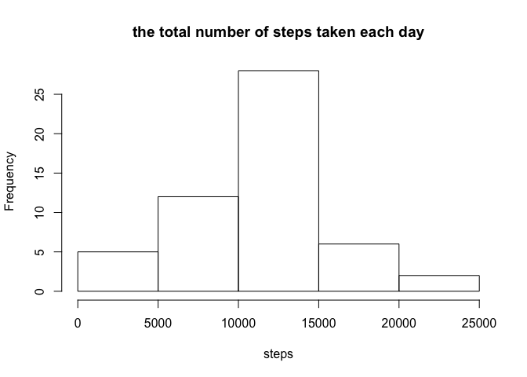
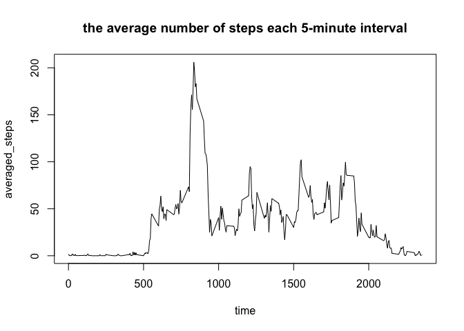
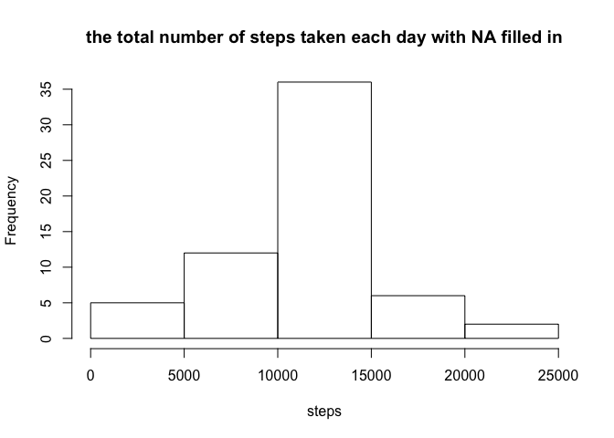
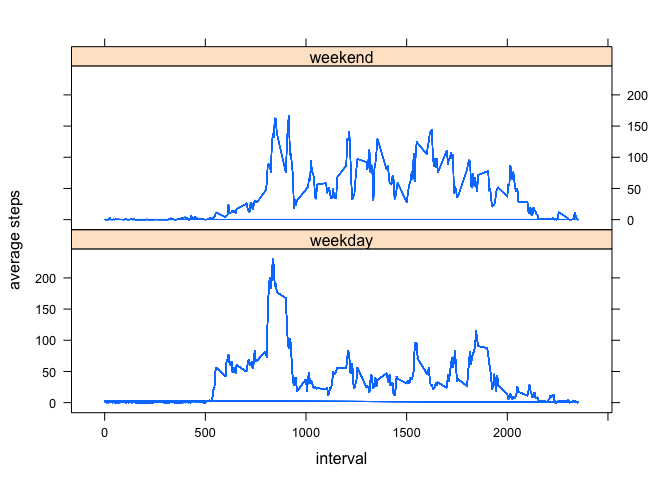

# Reproducible Research: Peer Assessment 1


## Loading and preprocessing the data

```r
activity<-read.csv("activity.csv")
head(activity)
```

```
##   steps       date interval
## 1    NA 2012-10-01        0
## 2    NA 2012-10-01        5
## 3    NA 2012-10-01       10
## 4    NA 2012-10-01       15
## 5    NA 2012-10-01       20
## 6    NA 2012-10-01       25
```
## What is mean total number of steps taken per day?

```r
steps_date<-tapply(activity$steps,activity$date,sum)
hist(steps_date,main = "the total number of steps taken each day",xlab = "steps")
```

<!-- -->

```r
## mean and median of the total number of steps taken per day
mean(steps_date,na.rm=TRUE)
```

```
## [1] 10766.19
```

```r
median(steps_date,na.rm = TRUE)
```

```
## [1] 10765
```
## What is the average daily activity pattern?

```r
steps_intv<-tapply(activity$steps,activity$interval,mean,na.rm=TRUE)
plot(x=rownames(steps_intv),type="l",y=steps_intv,main= "the average number of steps each 5-minute interval",xlab="time",ylab="averaged_steps")
```

<!-- -->

```r
which.max(steps_intv)
```

```
## 835 
## 104
```
## Imputing missing values

```r
ok<-complete.cases(activity)
sum(!ok)
```

```
## [1] 2304
```

```r
library(dplyr)
```

```
## Warning: package 'dplyr' was built under R version 3.1.3
```

```
## 
## Attaching package: 'dplyr'
```

```
## The following objects are masked from 'package:stats':
## 
##     filter, lag
```

```
## The following objects are masked from 'package:base':
## 
##     intersect, setdiff, setequal, union
```

```r
act_intv<-group_by(activity,interval)
head(act_intv)
```

```
## Source: local data frame [6 x 3]
## Groups: interval [6]
## 
##   steps       date interval
##   (int)     (fctr)    (int)
## 1    NA 2012-10-01        0
## 2    NA 2012-10-01        5
## 3    NA 2012-10-01       10
## 4    NA 2012-10-01       15
## 5    NA 2012-10-01       20
## 6    NA 2012-10-01       25
```

```r
mean_intv<-mutate(act_intv,ave=mean(steps,na.rm = TRUE))
head(mean_intv)
```

```
## Source: local data frame [6 x 4]
## Groups: interval [6]
## 
##   steps       date interval       ave
##   (int)     (fctr)    (int)     (dbl)
## 1    NA 2012-10-01        0 1.7169811
## 2    NA 2012-10-01        5 0.3396226
## 3    NA 2012-10-01       10 0.1320755
## 4    NA 2012-10-01       15 0.1509434
## 5    NA 2012-10-01       20 0.0754717
## 6    NA 2012-10-01       25 2.0943396
```

```r
mean_intv[!ok,1] <- mean_intv[!ok,4]
head(mean_intv)
```

```
## Source: local data frame [6 x 4]
## Groups: interval [6]
## 
##       steps       date interval       ave
##       (dbl)     (fctr)    (int)     (dbl)
## 1 1.7169811 2012-10-01        0 1.7169811
## 2 0.3396226 2012-10-01        5 0.3396226
## 3 0.1320755 2012-10-01       10 0.1320755
## 4 0.1509434 2012-10-01       15 0.1509434
## 5 0.0754717 2012-10-01       20 0.0754717
## 6 2.0943396 2012-10-01       25 2.0943396
```

```r
## a new dataset with na filled in
steps_date_rmna<-tapply(mean_intv$steps,mean_intv$date,sum)
hist(steps_date_rmna,main = "the total number of steps taken each day with NA filled in",xlab = "steps")
```

<!-- -->

```r
mean(steps_date_rmna)
```

```
## [1] 10766.19
```

```r
median(steps_date_rmna)
```

```
## [1] 10766.19
```
## Are there differences in activity patterns between weekdays and weekends?

```r
library(lattice)
```

```
## Warning: package 'lattice' was built under R version 3.1.3
```

```r
mean_intv<-transform(mean_intv,date=as.Date(date))
mean_intv<-mutate(mean_intv,days=weekdays(date))
head(mean_intv)
```

```
##       steps       date interval       ave   days
## 1 1.7169811 2012-10-01        0 1.7169811 Monday
## 2 0.3396226 2012-10-01        5 0.3396226 Monday
## 3 0.1320755 2012-10-01       10 0.1320755 Monday
## 4 0.1509434 2012-10-01       15 0.1509434 Monday
## 5 0.0754717 2012-10-01       20 0.0754717 Monday
## 6 2.0943396 2012-10-01       25 2.0943396 Monday
```

```r
steps_days<-mean_intv[,-4]
head(steps_days)
```

```
##       steps       date interval   days
## 1 1.7169811 2012-10-01        0 Monday
## 2 0.3396226 2012-10-01        5 Monday
## 3 0.1320755 2012-10-01       10 Monday
## 4 0.1509434 2012-10-01       15 Monday
## 5 0.0754717 2012-10-01       20 Monday
## 6 2.0943396 2012-10-01       25 Monday
```

```r
wkd<-steps_days$days %in% c("Monday","Tuesday","Wednesday","Thursday","Friday")
wkend<-steps_days$days %in% c("Saturday","Sunday")
steps_days$week[wkd]<-"weekday"
steps_days$week[wkend]<-"weekend"
head(steps_days)
```

```
##       steps       date interval   days    week
## 1 1.7169811 2012-10-01        0 Monday weekday
## 2 0.3396226 2012-10-01        5 Monday weekday
## 3 0.1320755 2012-10-01       10 Monday weekday
## 4 0.1509434 2012-10-01       15 Monday weekday
## 5 0.0754717 2012-10-01       20 Monday weekday
## 6 2.0943396 2012-10-01       25 Monday weekday
```

```r
step_week_invt<-group_by(steps_days,week,interval)
step_week_invt<-mutate(step_week_invt,ave_step=mean(steps))
head(step_week_invt)
```

```
## Source: local data frame [6 x 6]
## Groups: week, interval [6]
## 
##       steps       date interval   days    week   ave_step
##       (dbl)     (date)    (int)  (chr)   (chr)      (dbl)
## 1 1.7169811 2012-10-01        0 Monday weekday 2.25115304
## 2 0.3396226 2012-10-01        5 Monday weekday 0.44528302
## 3 0.1320755 2012-10-01       10 Monday weekday 0.17316562
## 4 0.1509434 2012-10-01       15 Monday weekday 0.19790356
## 5 0.0754717 2012-10-01       20 Monday weekday 0.09895178
## 6 2.0943396 2012-10-01       25 Monday weekday 1.59035639
```

```r
xyplot(ave_step ~ interval | week, data = step_week_invt, type="l",xlab = "interval", ylab = "average steps",layout = c(1,2))
```

<!-- -->

